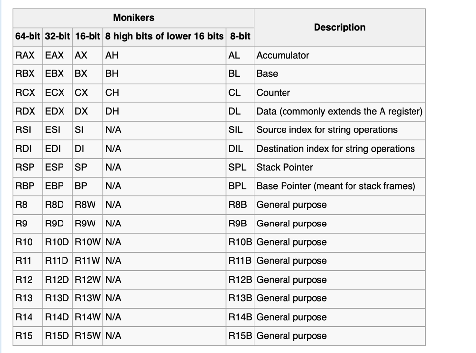

Dans ce voyage au cœur des fichiers binaires et du code executable se trouve l'empereur de tous les langages informatique, la source première du dialogue avec nos CPU : l'assembleur.

Je ne vais pas produire ici sur ce blog des cours d'assembleur. Il en existe de nombreux et d'excellente facture sur internet. Je vais juste poser quelques rappels qui m'apparaissent essentiels pour la suite de notre voyage dans le Reverse Engineering des binaires.

### Nature de l'assembleur

L'assembleur est un langage. Comme ce langage est spécifique et lié au type de CPU auquel il s'adresse, il en existe donc plusieurs types. Le nom de l'assembleur prend d'ailleurs le nom du CPU pour lequel il est destiné. Dans le cadre de notre apprentissage, nous allons limiter nos reverse a 2 familles de CPU : INTEL X86 et ARM (64 bit). 

INTEL (aka x86) : nous allons principalement lire (et un peu écrire) du code Intel 32 bit (x86_32) et Intel 64 bit. On retrouve ce dernier derriere les différents acronymes suivants : 'x64', 'x86_64', 'Intel64', 'AMD64'. Cela nous permettra d'adresser les PC (sous Windows et sous Linux avec leurs différents formats de fichier binaire ELF pour Linux, PE pour Windows), ainsi que les Mac Intel avec leur format de fichier binaire MACHO) ARM64 : L'étude de code s’exécutant sur processeur ARM64, nous permettra de reverser et de comprendre les applications et malware compilés nativement pour les Mac M1.

On utilise souvent à tort l'expression langage machine pour désigner l'assembleur. Méfions-nous de ce raccourci qui laisse penser qu'un CPU comprendrait l'assembleur : non, le seul codage que comprenne un CPU sont les signaux binaires (les Opcode). L'assembleur est la "dernière" grammaire/abstraction qu'un humain peut raisonnablement utiliser pour écrire les instructions qu'il souhaite faire exécuter par le CPU.
Tailles et unités

Il m’apparaît intéressant de rappeler ici quelques unités sur les  informations que nous allons manipuler :
```c
- BYTE - un Octet (8 bits) | Permet de stocker des valeurs entre 0-255 ou -128 à 127 

- WORD - Word (16 bits) | permet de stocker des valeurs entre 0 - 65535 ou -32768 à 32767 

- DWORD - Double word (32 bits) | Permet de stocker des valeurs de 0 - 232 

- QWORD - Quad word (64 bits) | Permet de stocker des valeurs de 0 0 - 2^64
```
### Les registres des CPU x86 et x64

Chaque CPU dispose d'un ensemble de registres d’intérêt général, 8 pour x86 et 16 pour x86-64. Un registre est une zone mémoire particulière, intégrée au CPU, dont l'accès est ultra-rapide et qui permet de stocker des données non-typées de manière (très) temporaire. C'est par ces/ses registres (mais pas uniquement) que le CPU reçoit et "transfert" les informations ,les conserve temporairement et les transmet selon les instructions de son unité de contrôle (ECU).

Voici les registres du x64 qui vont nous intéresser le plus dans nos travaux. Pour mémoriser leur convention d'utilisation (CPU et/ou OS) , "faite parler" la 2 ème lettre du nom du registre, c'est elle qui porte le sens :


->  <-


Nous reviendrons sur les registres très prochainement, afin de présenter leur convention d'usage et notamment en Win32s et en Wow64.

Mais avant cela, nous avons 2 notions essentielles préalables avec lesquelles il vous faut vous familiariser : La pile et les conventions d'appels. Justement, c'est l'objet de ce petit billet ici.
A un même assembleur, 2 syntaxes

Pour des raisons historiques, il existe 2 syntaxes possibles pour un même code assembleur : La syntaxe AT&T et la syntaxe INTEL. Comprenez bien : il s'agit du même assembleur (donc des mêmes instructions). Seules les conventions d'écriture changent.

Prenons un code qui en langage C serait:
````c
int i = 62;
j = i;
````
**Syntaxe INTEL**
````asm
mov rax,0x3e
mov [ebp-8],rax
````
**Syntaxe AT&T**
```asm
movq $0x3e,%rax
movq %rax,-8(%ebp)
```


Les principales différences entre les 2 syntaxes sont résumées dans le tableau ci-dessous :

La pratiquant depuis toujours, j'ai une préférence toute personnelle pour la syntaxe Intel. Sachez néanmoins que nous allons beaucoup utiliser le debugger gdb, et que ce dernier utilise par défaut la syntaxe AT&T. Si comme moi vous voulez lui faire générer de l'Intel, c'est possible

```bash
set disassembly-flavor intel
```

Avant de parler des différentes conventions d'appel, il nous faut faire un bref rappel sur le fonctionnement de la pile (Stack) : c'est par ici