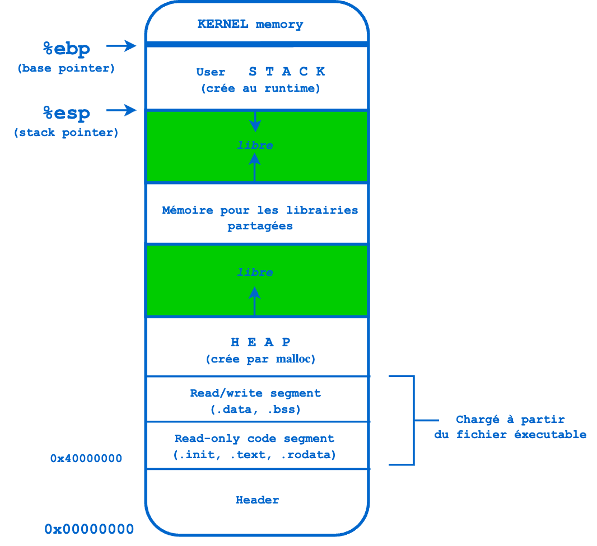

    Lorsque l'on souhaite se lancer dans le reverse engineering de binaires, on pense que l'assembleur est LA barrière d'entrée complexe. En réalité, l'assembleur est d'une syntaxe simplissime, d'une logique totale et donc d'un niveau de complexité très faible. Ce qui est complexe, vient d'une erreur de départ tres répandue : commencer à lire du code assembleur sans avoir, au préalable, maitriser pleinement les 4 elements suivants :

1.  Le fonctionnement de mémoire et plus particulièrement de la Stack
2.  Les registres
3.  Les conventions d'appels définies par ```l'ABI (_Application Binary Interface_)```
4.  **Le fonctionnement de la Stack ;-)**


## La mémoire
Vaste sujet que la mémoire. Je vais synthétiser ici les principaux éléments qui nous seront nécéssaires pour notre reverse des malwares x64.

Chaque processus en cours d'exécution obtient son propre espace d'adressage virtuel. La quantité d'espace dépend de l'architecture (32-bits ou 64-bits), des paramètres système et du système d'exploitation. 

Seule une petite partie de cet espace virtuel au sein de chaque processus est mappée à la mémoire physique. Il existe différentes manières d'effectuer le mapping de la mémoire virtuelle à physique grâce à l'utilisation de la pagination et de la traduction d'adresses.

<BR/><BR/><BR/>

<BR/><BR/><BR/>

Les différentes sections de la mémoire virtuelle :

| Section               | Données stockées<br/>dans la section                                                                                                                                                                                                                                                    | Exemple en C |
|-----------------------|-----------------------------------------------------------------------------------------------------------------------------------------------------------------------------------------------------------------------------------------------------------------------------------------|--------------|
| **.text**             | Correspond essentiellement à la partie .text du fichier exécutable binaire. Il contient les instructions a executer. Sa taille est fixée au moment de l'exécution lorsque le processus est chargé pour la première fois                                                                 |              |
| **.rodata**           | Stocke les variables **globales initialiées** (en lecture seule)                                                                                                                                                                                                                        | ```int x = 10;``` |
| **.data**             | Stocke les variables **globales initialiées**                                                                                                                                                                                                                                           | ```int x = 10;``` |
| **.bss**              | Stocke les variables **globales NON initialiées** (en lecture/ecriture, mais non éxécutable)                                                                                                                                                                                            | ```int x;``` |
| **HEAP (le tas)**     | Stocke des variables allouées dynamiquement et se développe de la mémoire à adresse inférieure vers la mémoire à adresse supérieure. L'allocation de mémoire est contrôlée par les fonctions ```malloc(), realloc() et free()```.                                                       | ```int x = malloc(sizeof(int);``` |
| **_shared librairies_** |                                                                                                                                                                                                                                                                                         |              |
| **STACK (la pile)**   | La pile garder une trace des appels de fonction (récursivement) et se développe de la mémoire à adresse supérieure vers la mémoire à adresse inférieure. La pile stocke les variables locales. Si le processus est multithread, chaque thread aura une pile unique (mais un tas commun) |              |

-------------
<BR/><BR/>

## Mais c'est quoi la Stack ? 

La stack, la pile en français, est une mémoire volatile, rapide d'accès et organisée selon le principe LIFO (Last-in, First-out). On utilise l'instruction ```PUSH``` pour stocker une valeur dans la pile (on dit alors "empiler") (ex:```PUSH 0xf56a46```). On l'instruction ```POP``` pour extraire/dépiler la dernière valeur empilée et la placer dans le registre du CPU spécifié  (ex:```POP ecx```).

- Le registre **EBP** stocke l'adresse de la base/début de la stack frame actuelle (elle désigne **l'adresse la plus haute de la stack** frame en cours d'exécution) 


- Le registre **ESP** stocke l'adresse du dessus  de la pile (TOP), c'est-à-dire l'adresse de la fin actuelle de la pile du processus en cours. Elle désigne donc **l'adresse la plus basse de la stack**. 


- N'oubliez pas qu'un PUSH décrémente ESP et qu'un POP incrémente ESP.

Quand une fonction est exécutée, une Stack Frame (cadre de pile) est créée pour stocker ses informations (ex: ses variables locales). Cette nouvelle stack frame vient s'empiler sur la stack du thread. Quand cette fonction est terminée, la stack frame est abandonnée. C'est-à-dire que les registres ESP et EBP pointent à nouveau sur la Stack Frame de l'appelant. Le flux execution (dont l'adresse de la prochaine instruction est stockée dans le registre EIP) continue alors dans l'appelant à l'adresse qui suit le call. Cette adresse de retour (*return address*) ayant éte préalablement sauvegardée.

- La valeur (c-à-d son adresse) d'EBP reste fixe pour la stack frame
- La valeur d'ESP varie (vers le haut ou vers le bas) en fonction des données (nombre et taille) empilées ou dépilées sur cette stack frame
- Vous aurez noté que cette stack frame mesure à un instant t (EBP-ESP)

Regardons maintenant sur un schéma cette histoire d'appelant (*caller*) et d'appelé (*callee*), d'un point de vue des stack frame :


### Naviguer dans la Stack

La stack est utilisée pour stocker :

1.  Les variables locales d'une fonction
2.  Des arguments d'appel d'une fonction
3.  Des adresses de retour

**Mais où trouve t-on ces différentes informations dans la stack et comment y accede t-on ?**

On navigue dans une stack par adresses relatives (offset); relatives par rapport à son haut (c-à-d par rapport au registre ESP), ou relatives par rapport à sa base (le registre EBP).


**N'oubliez pas que sur x86 et x64 l'on décrémente ESP pour monter dans la stack (par exemple au fur et à mesure des allocations mémoire statique) et que l'on incrémente ESP pour descendre dans la stack**. Au début cela est un peu perturbant, mais vous verrez, on s'y fait très vite : "*Plus pour descendre*", "*Moins pour monter*" ;-) Par exemple pour réserver de la mémoire sur la stack, on diminue ESP de la taille à réserver : 

```asm 
sub esp, <taille à réserver>
```


### Le Passage d'arguments par la stack

Il existe plusieurs conventions qui permettent de specifier les modalités de passage d'arguments à une fonction (paramètres émis par l'**appelant** et donc reçus par l'**appelé**). Nous étudierons plus bas ces différentes conventions d'appel (*convention call*). Ce qui nous intéresse ici pour le moment, c'est de comprendre où et comment ces arguments passés par la stack se positionnent en mémoire. L'objectif est évidement de pouvoir accéder aux valeurs de ces paramètres.


Prenons l'appel de fonction C suivante :

```c
int __attribute__((__cdecl__)) additionne(int a,int b, int c);
int somme=additionne(20, 30,40); 
```

**Note** _: à ce stade ne faites pas attention aux mots clés ```__cdecl___` et __attribute__``` qui permettent juste de faire en sorte que le compilateur C 32-bits utilise la stack (et non pas les registres) pour passer les arguments à la fonction. Nous y reviendrons juste après lorsque nous verrons les différentes conventions d'appel._

Notre compilateur C 32 bits aurait donc traduit ce code C oar le code assembleur suivant (sur un x86 32-bit[^2])

```asm
push 0x28      ; argument 3 | 40 en decimal
push 0x1e      ; argument 2 | 30 en decimal
push 0x14      ; argument 1 | 20 en decimal
call additionne ; additionne(20,30,40)
```

La stack frame de la fonction ```main()``` **AVANT L'EXECUTION DE LA PREMIERE INSTRUCTION** de la fonction ```additionne()``` serait alors la suivante :

<BR/><BR/><BR/>


Avant d'appeler la fonction ```additionne```, la fonction ```main()``` sauvegarde les registres EAX, ECX et EDX, seulement si ces derniers risquent d'etre écrasés par la fonction ```additionne``` qu'il s'apprète à appeler. En l'occurrence notre fonction ```additionne``` utilisera que les registres EAX et EDX.

Puis ```main``` **push** sur la pile les 3 arguments avec lesquels il va appeler la fonction ```additionne```.

Et enfin vient le temps du CALL. En assembleur l'instruction CALL réalise les actions suivantes :
1. Le contenu du registre EIP est poussé sur la pile
2. Transfert le fux d'éxécution vers l'adresse de la fonction à appeler (grace au registre spécial EIP) 

Ainsi nous obtenons une stack frame de ```main``` avec son adresse de retour sauvegardée sur le haut de la pile. Cette adresse de retour permettra au flux exécution de reprendre à l'adresse où il était juste avant son ```CALL```, lorsqu'il sortira de la fonction appelée (ici ```additionne```). Ainsi, le flux ne souffrira d'aucune interruption.


Dans cette perspective, ```main()``` est la fonction **"appelante"** de la fonction ```additionne```. Intéressons-nous maintenant à la fonction appelée : ```additionne()```.
Prenons par exemple son code C suivant:

```c
int __attribute__((__cdecl__)) additionne(int a,int b, int c) {
    return a+b+c;
}
```

, dont la compilation en assembleur 32-bits donne:


```asm
0x0000118d         push       ebp                       ; PROLOGUE de la fonction 
0x0000118e         mov        ebp, esp                  ;
0x00001190         mov        edx, dword [ebp+8]        ; int a
0x00001193         mov        eax, dword [ebp+12]       ; int b
0x00001196         add        edx, eax                  ; allez hop (a+b) dans edx
0x00001198         mov        eax, dword [ebp+16]       ; int c
0x0000119b         add        eax, edx                  ; allez hop (edx + c) dans eax
0x0000119d         pop        ebp                       ;
0x0000119e         ret                                  ; par convention le resultat de la fonction est posée dans eax
```
On distingue 3 parties dans le code de cette fonction :
1. Son prologue
2. Son traitement
3. Son épilogue

**Le prologue de la fonction _additionne_**
```asm
0x0000118d         push       ebp                       ; Sauvegarde EBP sur la pile 
0x0000118e         mov        ebp, esp                  ; Définit l'EBP de notre fonction en la faisant pointer sue ESP
```
Le role du prologue d'une fonction est donc


### Stocker les variables locales
## L'ABI (Application Binary Interface)


Une ABI définit la manière dont les structures de données et les données sont accessibles dans le code machine. Pour exemple les conventions d'appels (que nous allons voir un peu plus bas) sont définies au sein des ABI

Adhérer à une ABI (qui peut, ou non, être officiellement standardisée) est généralement le travail d'un compilateur (pour produire le binaire) et d'un système d'exploitation (pour exécuter le binaire). Cependant, un développeur peut avoir à traiter directement avec une ABI lors de l'écriture d'un programme utilisant plusieurs langages de programmation (ex: C pour Windows et Assembleur), ou même de la compilation d'un programme écrit dans le même langage avec différents compilateurs.

Quand on manipule du code assembleur issu du reverse d'un programme binaire, nous sommes dans l'obligation de prendre en compte l'ABI qu'il utilise.

Les détails couverts par une ABI incluent les éléments suivants :
1. **Jeu d'instructions** du processeur, avec des détails tels que la structure des registres, l'organisation de la pile, les types d'accès à la mémoire, etc.

2. **Tailles**, dispositions et alignements des types de données de base auxquels le processeur peut accéder directement

3. **Convention d'appel**, qui contrôle la façon dont les arguments des fonctions sont passés et les valeurs de retour récupérées. Par exemple, l'ABI définit les éléments suivants :
   - Si tous les paramètres sont passés sur la pile, et/ou certains sont passés dans des registres
   - Quels registres sont utilisés pour quels paramètres de fonction
   - Si le premier paramètre de fonction passé sur la pile est poussé en premier ou en dernier

4. Comment une application doit effectuer des appels système au système d'exploitation, et si l'ABI spécifie des appels système directs plutôt que des appels de procédure, les numéros d'appel système

5. Dans le cas d'un système d'exploitation complet, l'ABI de l'OS normalise le format binaire des fichiers objets, des bibliothèques binaires, ...


***

Notes

***

[^1]: _Attention l'instruction POP ne supprime pas réellement les éléments de la pile, elle modifie simplement l'emplacement vers lequel pointe le registre RSP._

[^2]: _je précise ici sur x86, car sur ARM et x64 le mot clé ```__cdecl``` n'est pas pris en compte par le compilateur. En effet, la convention exige que sur processeur ARM et x64, les paramètres soient passés autant que possible par les registres, puis ensuite par la stack._
